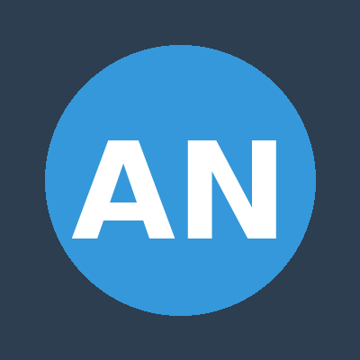

  
  
  # 👋 Hello, I'm Alpha Narwhal
  
  ### Software Developer | Tech Enthusiast | Problem Solver
  
  
  
  

---

## 👨‍💻 About Me

I'm a passionate software developer with a keen interest in building innovative solutions and exploring cutting-edge technologies. With a strong foundation in full-stack development and a commitment to continuous learning, I strive to create efficient, scalable, and user-friendly applications.

- 🔭 Currently working on web applications and open-source projects
- 🌱 Continuously learning new technologies and best practices
- 💡 Passionate about clean code, design patterns, and software architecture
- 🎯 Goal: Contributing to impactful projects and growing as a developer
- ⚡ Fun fact: Named after one of the most mysterious creatures of the Arctic!

---

## 🛠️ Skills & Technologies

### Programming Languages

### Frameworks & Libraries

### Databases

### Tools & Technologies

---

## 💼 Projects & Work

### 🚀 Featured Projects

#### 1. **E-Commerce Platform**
*Full-stack web application for online shopping*
- **Tech Stack:** React, Node.js, Express, MongoDB
- **Features:** User authentication, product catalog, shopping cart, payment integration
- **Highlights:** Implemented RESTful API, responsive design, and secure payment processing
- **Status:** ✅ Completed

#### 2. **Task Management System**
*Collaborative project management tool*
- **Tech Stack:** Python, Django, PostgreSQL, Bootstrap
- **Features:** Task assignment, progress tracking, team collaboration, real-time notifications
- **Highlights:** Built with clean architecture principles and comprehensive test coverage
- **Status:** ✅ Completed

#### 3. **Weather Dashboard**
*Real-time weather information and forecasting application*
- **Tech Stack:** JavaScript, React, OpenWeather API, Chart.js
- **Features:** Current weather data, 7-day forecast, location search, data visualization
- **Highlights:** Responsive UI with interactive charts and smooth animations
- **Status:** ✅ Completed

#### 4. **Portfolio Website**
*Personal portfolio showcasing projects and skills*
- **Tech Stack:** HTML5, CSS3, JavaScript, GitHub Pages
- **Features:** Project gallery, contact form, responsive design, smooth scrolling
- **Highlights:** Modern design with CSS animations and mobile-first approach
- **Status:** 🔄 Active

#### 5. **Data Analysis Tool**
*Python-based tool for data processing and visualization*
- **Tech Stack:** Python, Pandas, NumPy, Matplotlib, Jupyter
- **Features:** Data cleaning, statistical analysis, interactive visualizations
- **Highlights:** Automated data pipeline with comprehensive documentation
- **Status:** ✅ Completed

---

## 📊 GitHub Stats

  
  
  
  
  

---

## 📫 Get In Touch

Feel free to reach out if you'd like to collaborate on a project, discuss tech, or just say hi!

- 📧 Email: alpha.narwhal@example.com
- 💼 LinkedIn: [linkedin.com/in/alpha-narwhal](https://linkedin.com)
- 🐦 Twitter: [@AlphaNarwhal](https://twitter.com)
- 🌐 Portfolio: [alpha-narwhal.dev](https://alpha-narwhal.dev)

---

  <i>⭐️ From [Alpha-Narwhal](https://github.com/Alpha-Narwhal)</i>
  
  

